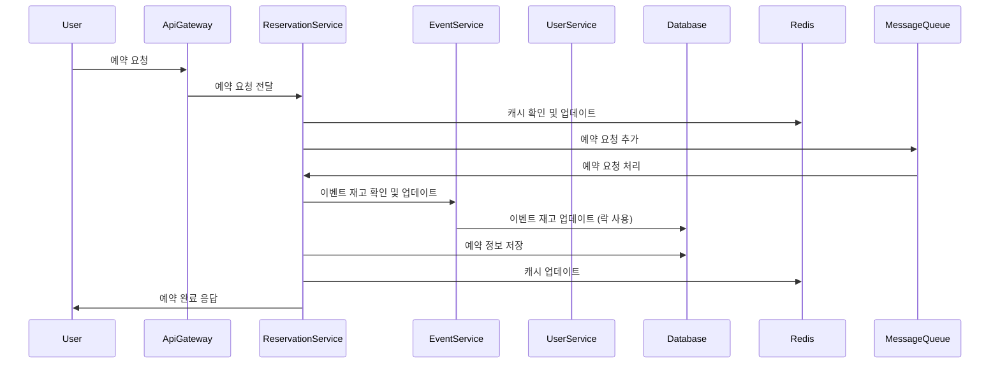

# 예약 시스템 프로젝트 
:date: 2024년 6월 ~ 2024년 7월
 


## 프로젝트 소개
Redis를 활용한 캐싱 전략, 대규모 티켓 예약 처리

## 프로젝트 주요 목표
1. 마이크로서비스 아키텍처 구현
2. 대규모 동시 접속 처리

🚀 시작 가이드
📥설치
```
$ git clone --branch local-deploy https://github.com/jsjune/E-commerce.git](https://github.com/xiexiehanoi/korder
$ cd korder
```

▶️실행(Rdis)
```
$ ./gradlew docker
$ docker-compose -f redis-compose.yml up -d
```

## 주요 기능
- 사용자 인증 및 관리
- 이벤트 생성 및 관리
- 실시간 티켓 예약 처리
- 티켓 재고 관리

## 기능 및 기술적 구현
1. **초기 모놀리식 아키텍처**
   - 단일 애플리케이션으로 시작하여 모든 기능을 하나의 코드베이스에서 관리

2. **마이크로서비스 아키텍처(MSA)로 전환**
   - 서비스들을 독립적으로 배포 및 확장할 수 있도록 분리

3. **과부하 및 동시 접속 처리**
   - 예약 시스템이 과부하 및 동시 접속을 처리할 수 있도록 설계

4. **락(Optimistic/Pessimistic) 사용**
   - 초기에는 낙관적/비관적 락을 사용하여 동시성 문제를 해결
   - 낙관적 락
   - 비관적 락

5. **Redis 캐싱 및 메시지 큐 활용**
   - Redis를 사용한 캐싱 및 메시지 큐를 통한 비동기 처리로 성능 최적화

## 트러블슈팅 사례

 

## 시퀀스 다이어그램


## ERD


