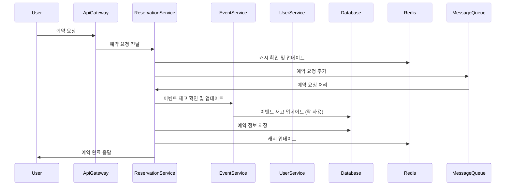

# 예약 시스템 프로젝트

## 프로젝트 개요
이 프로젝트는 예약 시스템을 구축하기 위한 것입니다. 초기에는 모놀리식 아키텍처로 시작하여, 이후 마이크로서비스 아키텍처(MSA)로 전환했습니다. 과부하 및 동시 접속을 처리할 수 있도록 설계되었으며, Redis 캐시와 메시지 큐를 활용한 시스템입니다.

## 기능 및 기술적 구현
1. **초기 모놀리식 아키텍처**
   - 단일 애플리케이션으로 시작하여 모든 기능을 하나의 코드베이스에서 관리

2. **마이크로서비스 아키텍처(MSA)로 전환**
   - 서비스들을 독립적으로 배포 및 확장할 수 있도록 분리

3. **과부하 및 동시 접속 처리**
   - 예약 시스템이 과부하 및 동시 접속을 처리할 수 있도록 설계

4. **락(Optimistic/Pessimistic) 사용**
   - 초기에는 낙관적/비관적 락을 사용하여 동시성 문제를 해결
   - 낙관적 락
   - 비관적 락

5. **Redis 캐싱 및 메시지 큐 활용**
   - Redis를 사용한 캐싱 및 메시지 큐를 통한 비동기 처리로 성능 최적화

## 트러블슈팅 사례

 
## 아키텍처 구성 설명
1. **사용자 인터페이스**
- 사용자(User)는 예약 요청을 API 게이트웨이(ApiGateway)를 통해 진행.
2. **게이트웨이**
- **API 게이트웨이(ApiGateway)**: 사용자 요청을 각 서비스로 전달.
3. **서비스 레이어**
- **예약 서비스(ReservationService)**: 예약 요청을 처리하고, Redis 캐시를 확인 및 업데이트하며, 메시지 큐에 예약 요청을 추가.
- **이벤트 서비스(EventService)**: 이벤트 재고를 확인하고, 데이터베이스에서 재고를 업데이트.
- **사용자 서비스(UserService)**: 사용자 정보를 관리.
4. **인프라스트럭처 레이어**
- **Redis 캐시**: 캐시된 데이터를 관리하여 빠른 데이터 접근을 제공합니다.
- **메시지 큐**: 비동기 처리를 통해 시스템의 확장성과 성능을 높입니다.
- **데이터베이스**: 각 서비스에 필요한 데이터베이스로, 예약, 이벤트, 사용자 정보 등을 관리합니다. 각 서비스는 독립적인 데이터베이스를 사용합니다.
  
 

## 시퀀스 다이어그램

